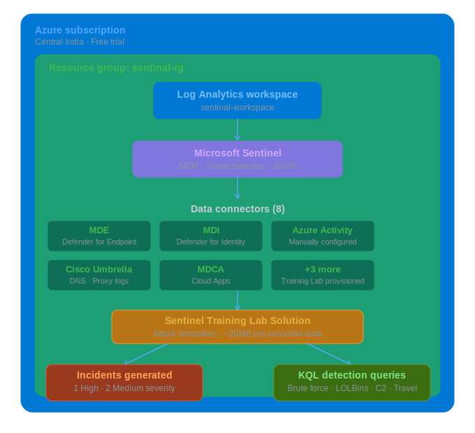

# 🛡️ Microsoft Sentinel SOC Lab

> End-to-end SIEM deployment on Microsoft Azure — workspace setup, 
> data connectors, live incident generation, and KQL threat detection.


---

## 🏗️ Architecture



## 📋 Project Overview

| Detail | Value |
|--------|-------|
| Platform | Microsoft Azure |
| SIEM | Microsoft Sentinel |
| Workspace | sentinal-workspace |
| Region | Central India |
| Data Connectors | 8 (Training Lab) + Azure Activity (manual) |
| Incidents Generated | 3 (1 High, 2 Medium) |
| KQL Queries | 4 SOC detection queries |

---

## 🔧 Lab Setup

### 1. Log Analytics Workspace
- Created Resource Group: `sentinal-rg`
- Deployed Log Analytics Workspace: `sentinal-workspace` (Central India)

### 2. Microsoft Sentinel Deployment
- Added Sentinel to `sentinal-workspace`
- Installed Microsoft Sentinel Training Lab Solution from Content Hub
- Training Lab provisioned 8 data connectors automatically
- Azure Activity connector was disconnected — manually reconfigured it

### 3. Incidents Generated
- 3 live incidents auto-generated from Training Lab attack simulation
- 1 High severity, 2 Medium severity

---

## 🔍 KQL Detection Queries

### 1. Brute Force Detection
```kql
DeviceLogonEvents
| where LogonType == "Network"
| summarize Attempts = count() by AccountName, DeviceName
| where Attempts > 5
| sort by Attempts desc
```

### 2. Suspicious Process Execution (LOLBins)
```kql
DeviceProcessEvents
| where FileName in ("powershell.exe", "cmd.exe", "wscript.exe", "mshta.exe")
| project Timestamp, DeviceName, AccountName, FileName, ProcessCommandLine
| sort by Timestamp desc
| take 20
```

### 3. Network Beaconing / C2 Detection
```kql
DeviceNetworkEvents
| summarize Connections = count() by DeviceName, RemoteIP, RemotePort
| where Connections > 10
| sort by Connections desc
| take 20
```

### 4. Impossible Travel / Login Anomaly
```kql
UserLoginEvents
| summarize LoginCount = count() by UserName, Location, IPAddress
| sort by LoginCount desc
| take 20
```

---

## 📸 Screenshots

### Sentinel Overview — Live Incidents


### Data Connectors


### KQL — Brute Force Detection


### KQL — Suspicious Process Execution


### KQL — Network Beaconing


### KQL — Login Anomaly


---

## 🛠️ Skills Demonstrated

- Microsoft Azure — Resource Groups, Log Analytics, Subscriptions
- Microsoft Sentinel — Deployment, Data Connectors, Incident Management
- KQL — summarize, where, project, sort, dcount, make_set
- Threat Detection — Brute force, LOLBins, C2 beaconing, Impossible travel
- SOC Workflows — Incident triage, severity classification, threat hunting

---

## 📄 Documentation

Full project documentation with screenshots available in [Azure-Sentinel-SOC-Threat-Hunting-Lab.pdf](Azure-Sentinel-SOC-Threat-Hunting-Lab.pdf)

---

## 👤 Author

**Sairam Koduru**  
SOC Analyst | TryHackMe Top 1% | [github.com/kodurusairam](https://github.com/kodurusairam)
